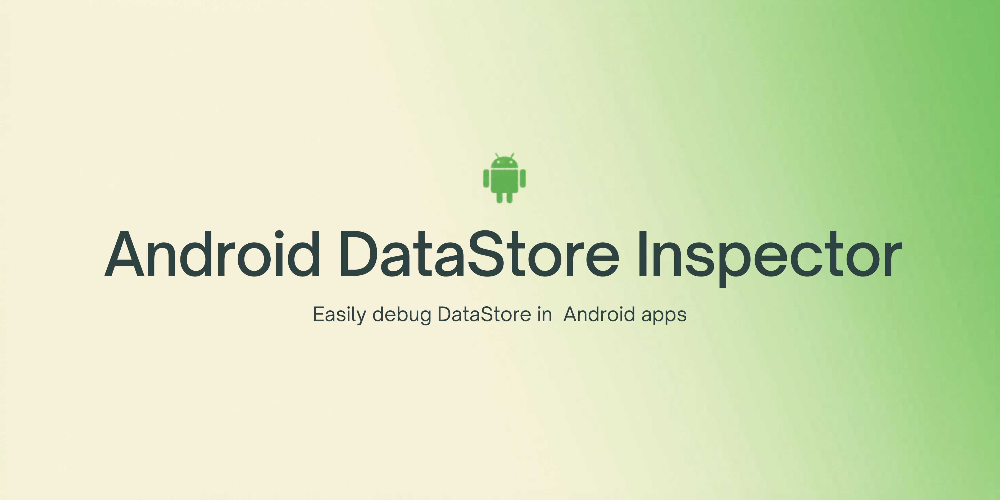
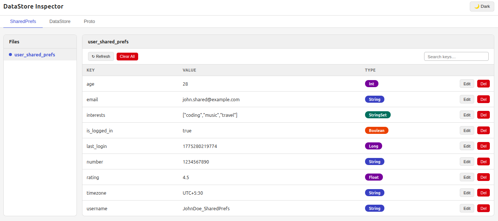
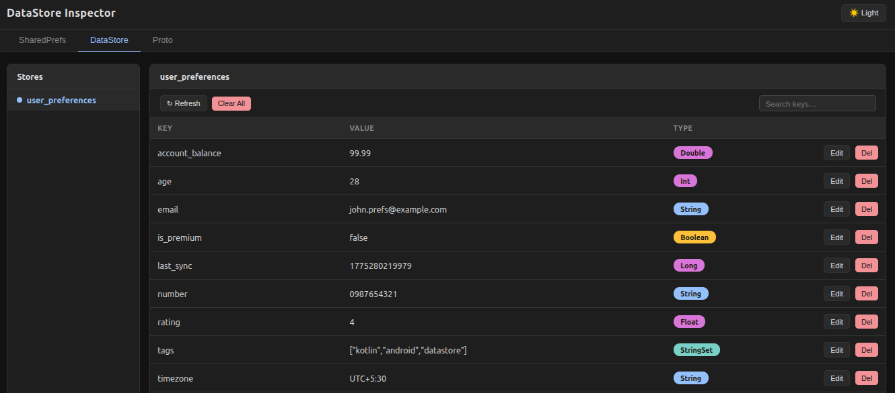

# DataStore Inspector



A debugging library for Android that lets you inspect and edit **SharedPreferences**, **DataStore Preferences**, and **Proto DataStore** from a browser.

It runs a lightweight HTTP server inside your app and serves a web UI you can open from any browser on the same network.

---

## Features

- View, edit, and delete **SharedPreferences** fields across all files
- View, edit, and delete **DataStore Preferences** fields
- View and edit **Proto DataStore** fields
- Color-coded type badges (String, Int, Long, Float, Double, Boolean, StringSet)
- Search keys by name in any tab
- Clear all keys from a store in one click
- Auto-refresh on a configurable interval (toggle in the UI)
- Light and dark theme

---

## Setup

### Step 1 — Add JitPack to your root `settings.gradle.kts`

```kotlin
dependencyResolutionManagement {
    repositories {
        maven { url = uri("https://jitpack.io") }
    }
}
```

### Step 2 — Add the dependencies

Use `debugImplementation` for the full library and `releaseImplementation` for the no-op module. The no-op module provides empty stub implementations of the same API so release builds compile without any inspector code or overhead.

```kotlin
dependencies {
    debugImplementation("com.github.Yashraj254.Android-DataStore-Inspector:inspector:latest-version")
    releaseImplementation("com.github.Yashraj254.Android-DataStore-Inspector:no-op:latest-version")
}
```

---

## Usage

The inspector **starts automatically** — no call to `start()` needed. Just register your DataStore instances and open the browser.

Register as many DataStore instances as you need by chaining calls:

```kotlin
class SampleApplication : Application() {
    override fun onCreate() {
        super.onCreate()
        DataStoreInspector
            .registerDataStore("user_preferences", userPreferencesDataStore)
            .registerDataStore("app_settings", appSettingsDataStore)
            .registerProto("user_prefs", userProtoDataStore)
            .registerProto("app_config", appConfigDataStore)
    }
}
```

> SharedPreferences are detected automatically — no registration needed.

---

## Open the inspector

Forward the port (works over USB or wireless adb):

```
adb forward tcp:5050 tcp:5050
```

Then open `http://localhost:5050` in your browser.

---

## Custom port

The default port is `5050`. The inspector auto-starts via App Startup before `Application.onCreate()` runs, so the server is already bound to 5050 by the time your code runs. To use a different port, just call `start()` with the port you want — the auto-started server will be stopped and rebound on the requested port:

```kotlin
class SampleApplication : Application() {
    override fun onCreate() {
        super.onCreate()
        DataStoreInspector.start(this, port = 8080)
        DataStoreInspector.registerDataStore("user_preferences", userPreferencesDataStore)
    }
}
```

If you'd rather skip the brief restart and have the server bind directly to your custom port, disable the auto-start initializer in your `AndroidManifest.xml`:

```xml
<application>
    <provider
        android:name="androidx.startup.InitializationProvider"
        android:authorities="${applicationId}.androidx-startup"
        android:exported="false"
        tools:node="merge">
        <meta-data
            android:name="com.yashraj.datastoreinspector.inspector.DataStoreInspectorInitializer"
            tools:node="remove" />
    </provider>
</application>
```

---

## Proto DataStore

Proto DataStore fields are read using **reflection by default** — no extra setup needed if your proto message follows standard getter conventions.

For full control over field names and type conversions, provide a custom `ProtoInspectorMapper`:

```kotlin
class UserPreferencesProtoMapper : ProtoInspectorMapper<UserPreferences> {

    override fun toEntries(proto: UserPreferences): List<ProtoEntry> = listOf(
        ProtoEntry("username", proto.username, "String"),
        ProtoEntry("email", proto.email, "String"),
        ProtoEntry("number", proto.number, "String"),
        ProtoEntry("age", proto.age.toString(), "Int"),
        ProtoEntry("is_premium", proto.isPremium.toString(), "Boolean"),
        ProtoEntry("rating", proto.rating.toString(), "Float"),
        ProtoEntry("last_login", proto.lastLogin.toString(), "Long"),
        ProtoEntry("account_balance", proto.accountBalance.toString(), "Double"),
    )

    override fun updateField(proto: UserPreferences, key: String, value: String): UserPreferences {
        val builder = proto.toBuilder()
        when (key) {
            "username" -> builder.username = value
            "email" -> builder.email = value
            "number" -> builder.number = value
            "age" -> builder.age = value.toInt()
            "is_premium" -> builder.isPremium = value.toBoolean()
            "rating" -> builder.rating = value.toFloat()
            "last_login" -> builder.lastLogin = value.toLong()
            "account_balance" -> builder.accountBalance = value.toDouble()
        }
        return builder.build()
    }
}
```

Pass it when registering:

```kotlin
DataStoreInspector.registerProto("user_prefs", userProtoDataStore, UserPreferencesMapper())
```

---

## Screenshots

**Light Theme**



**Dark Theme**



---

## License

```
Copyright 2026 Yashraj Singh Jadon

Licensed under the Apache License, Version 2.0 (the "License");
you may not use this file except in compliance with the License.
You may obtain a copy of the License at

   http://www.apache.org/licenses/LICENSE-2.0

Unless required by applicable law or agreed to in writing, software
distributed under the License is distributed on an "AS IS" BASIS,
WITHOUT WARRANTIES OR CONDITIONS OF ANY KIND, either express or implied.
See the License for the specific language governing permissions and
limitations under the License.
```
